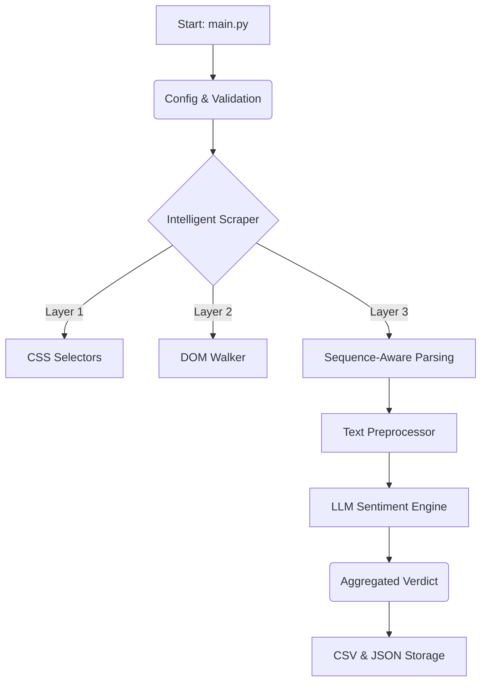

# Pipeline Walkthrough

A high-level overview of the engineering logic behind the Flipkart Review Analyzer.

## 🔄 The Logic Flow

---

## 🏗️ Core Architecture

| Component | Responsibility | Secret Sauce |
|-----------|----------------|--------------|
| **Scraper** | Live data extraction | **Tiered Heuristics**: If selectors fail, it "walks" the DOM looking for badges. |
| **Preprocessor** | Data sanitization | **Token-Aware**: Chunks long reviews to stay within LLM context limits. |
| **LLM Client** | Sentiment & Summary | **Context-Aware**: Summarizes each chunk then merges for a final result. |
| **Storage** | Persistence | **BOM-aware CSV**: Auto-retries if files are locked (e.g., open in Excel). |

---

## 🧠 The "Intelligent" Scraper Logic
The scraper doesn't just look for classes (which change frequently). It uses a **3-Layer Strategy**:
1.  **Direct Selectors**: Checks a known list of modern Flipkart classes.
2.  **Badge Walking**: If classes fail, it searches for strings like "Verified Purchase" and climbs the DOM tree to find the review box.
3.  **Sequence Parsing**: Once inside the box, it analyzes the *order* of text pieces (Name → Comma → Location → Badge) to extract metadata even if it's fragmented across 10 tags.

---

## 🚀 Execution Lifecycle

1.  **Initialization**: Loads `.env` and validates that ScraperAPI and Groq keys are present.
2.  **Scraping Phase**: Fetches the review pages through a proxy (ScraperAPI) to bypass bot protection.
3.  **Analysis Phase**: 
    - Text is cleaned and tokenized.
    - LLM analyzes sentiment (Positive/Negative/Neutral) and writes a 1-sentence summary.
4.  **Final Verdict**: After all reviews are processed, the LLM generates a "Final Verdict" JSON (Product Strengths, Weaknesses, and Verdict).
5.  **Storage**: Metadata and analysis are saved to `output/flipkart_reviews.csv` and `output/flipkart_reviews.json`.

---

## 📽️ Video Presentation Script (Suggested)

- **[0:00] Intro**: "Hi, I'm [Name]. I built a robust review analyzer that handles Flipkart's complex dynamic layouts."
- **[0:45] Run**: "Notice the validation phase—it ensures API keys are ready before starting."
- **[1:30] Scraping**: "Even if Flipkart changes their HTML tomorrow, my 'Badge Walking' logic will still find the reviews."
- **[3:00] Analysis**: "We're using Groq to analyze sentiment in near real-time. It handles rate limits automatically."
- **[4:30] Conclusion**: "The result is structured data and an automated buying recommendation."

---

## 🛠️ Performance Stats
- **Scraping**: ~2s per review (including network & proxy overhead).
- **Analysis**: ~1.5s per review (using Llama-3-70B via Groq).
- **Storage**: <1s for 50+ reviews.
